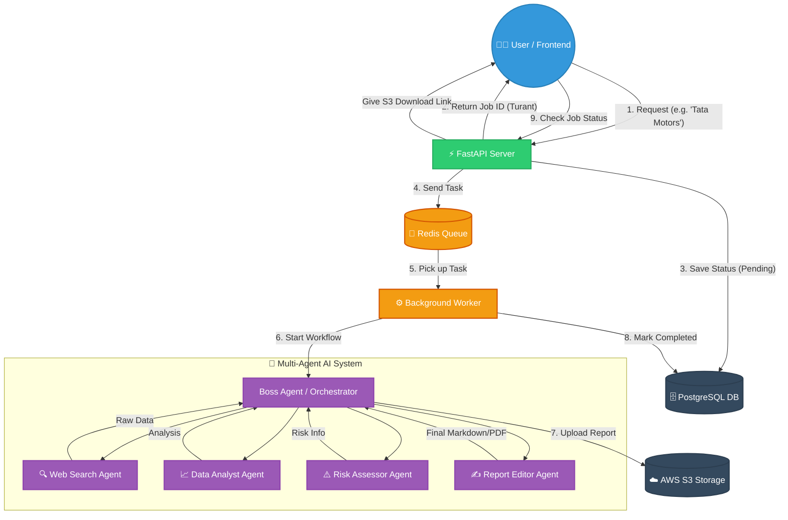

# 🤖 Agentic-Research-Engine

## 📊 Project Flow (Architecture Diagram)

Yeh is project ka visual flow hai ki user ki request se lekar final report banne tak data kaise travel karega.

## 🛠️ Tech Stack & Tools (100% Free Tier)
- **Backend Core**: FastAPI (Python)
- **AI Brain**: Gemini API / Groq
- **Multi-Agent Framework**: LangGraph ya CrewAI
- **Background Tasks**: Celery + Redis
- **Database**: PostgreSQL (via SQLAlchemy)
- **Cloud Storage**: AWS S3

## 📝 Step-by-Step Execution Plan (Kaise Banayenge?)
1. **Level 1:** Ek simple FastAPI server setup karna.
2. **Level 2:** LLM (Gemini) ko API se connect karna.
3. **Level 3:** Ek single agent banana jo web search kar sake.
4. **Level 4:** Baaki agents banana aur unhe aapas mein connect karna.
5. **Level 5:** Redis/Celery add karna taaki background mein kaam ho sake.
