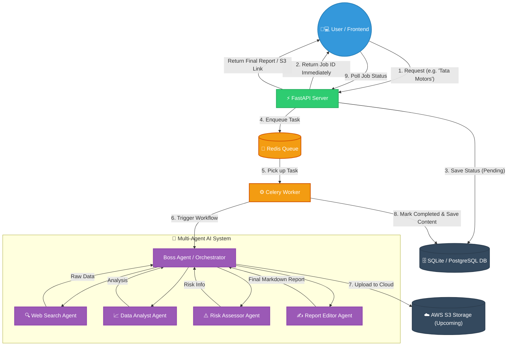

# 🤖 Agentic Financial Research Engine

A production-ready, asynchronous multi-agent AI system designed to generate comprehensive financial research reports. It leverages the power of LangGraph for orchestrating specialized AI agents, Celery and Redis for asynchronous background processing, and FastAPI for robust API routing.

## 📊 Project Flow (Architecture Diagram)

This visual flow demonstrates how data travels from the initial user request to the final generated report.



## 🛠️ Tech Stack & Tools
- **Backend Core**: FastAPI (Python)
- **AI Brain**: Groq API (Qwen/Mixtral Models)
- **Multi-Agent Framework**: LangGraph
- **Background Tasks**: Celery + Redis
- **Database**: SQLite (Development) / PostgreSQL (Production ready via SQLAlchemy)
- **Frontend**: HTML5, Vanilla CSS, JS (marked.js)
- **Cloud Storage**: AWS S3 (Planned for Next Phase)

## 🚀 Features

- **Multi-Agent Architecture (LangGraph):** Employs a relay-race methodology across four specialized AI agents to gather, analyze, and format financial data.
- **Asynchronous Processing:** Powered by **Celery** and **Redis**. API endpoints return instantly (yielding a `job_id`), preventing browser timeouts while intensive AI tasks run in the background.
- **Web Dashboard View:** Real-time polling updates the UI gracefully, rendering the final Markdown report directly into a beautifully styled HTML dashboard via `marked.js`.
- **Token Optimized:** Custom agent constraints ensure the system remains well within strict LLM API output token limits (e.g., Groq's Free Tier).

## 📋 Prerequisites

Before you begin, ensure you have the following installed:
- Python 3.10+
- Redis Server (Must be running locally or via Docker)
- API Keys: [Groq](https://console.groq.com/) (LLM), [Tavily](https://tavily.com/) (Search)

## 🛠️ Installation & Setup

1. **Clone the repository:**
   ```bash
   git clone https://github.com/yourusername/financial-research-system.git
   cd financial-research-system
   ```

2. **Set up a virtual environment:**
   ```bash
   python -m venv venv
   source venv/bin/activate  # On Windows: venv\Scripts\activate
   ```

3. **Install dependencies:**
   ```bash
   pip install -r requirements.txt
   ```

4. **Configure Environment Variables:**
   Create a `.env` file in the root directory and add your credentials:
   ```env
   # API Keys
   GROQ_API_KEY=your_groq_api_key_here
   TAVILY_API_KEY=your_tavily_api_key_here

   # Database
   DATABASE_URL=sqlite:///./research_engine.db

   # Redis Configuration
   REDIS_URL=redis://localhost:6379/0
   ```

## 🚦 Running the Application

This architecture requires two separate terminals to run the API and the background worker simultaneously.

**Terminal 1: Start the FastAPI Server**
```bash
uvicorn backend.main:app --reload
```
*The API will be available at `http://127.0.0.1:8000`. You can view the Swagger UI at `/docs`.*

**Terminal 2: Start the Celery Worker**
```bash
# On Windows (using solo pool):
celery -A worker.celery_app worker -l info -P solo

# On Linux/Mac:
celery -A worker.celery_app worker -l info
```

**Terminal 3: Launch the Frontend**
You can serve the frontend folder using any simple HTTP server.
```bash
cd frontend
python -m http.server 3000
```
*Open `http://localhost:3000` in your web browser to access the dashboard.*

## 🛣️ Future Scope (Day 2)
- **AWS S3 Integration:** Offload reports and generated charts to S3 storage.
- **User Authentication:** Integrate JWT-based login (Schema is already prepared).

## 📄 License
MIT License.
